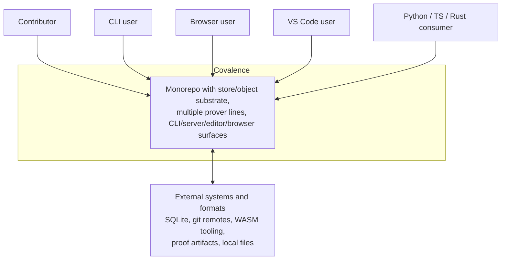

# C4 Architecture Map

This is the current repo-and-runtime map for Covalence. It describes the code
that exists today, not the whole target architecture described in
[`../ARCHITECTURE.md`](../ARCHITECTURE.md).

Use it with:

- [`where-we-are.md`](./where-we-are.md) for a narrative snapshot
- [`institution-map.md`](./institution-map.md) for the logic/integration view
- [`design/README.md`](./design/README.md) for proposals

## Level 1: System Context



### Interpretation

- Covalence is a multi-surface monorepo, not a single executable.
- The same repository serves storage work, theorem tooling, language tooling,
  and browser/editor integrations.
- External artifacts are part of the normal operating model: git data, WASM,
  proof formats, SQLite-backed persistence, and content-addressed blobs.

## Level 2: Container View

```mermaid
flowchart TB
    cli_user["CLI user"]
    browser_user["Browser user"]
    editor_user["VS Code user"]
    py_ts_user["Python / TS user"]

    subgraph surfaces["Covalence surfaces"]
        cli["`cov` CLI<br/>repl / serve / cog / hol / lsp"]
        server["`covalence-serve`<br/>HTTP + WebSocket API"]
        web["`apps/covalence-web`<br/>SvelteKit SPA"]
        vscode["`extensions/covalence-vscode`<br/>native or WASM LSP"]
        libs["Python + TS packages"]
    end

    subgraph runtime["Shared runtime and libraries"]
        shell["`covalence-shell`<br/>backend traits + store-first Kernel + Prover trait"]
        substrate["Store / object / hash / WASM crates"]
        logic["Kernel / Pure / HOL / proof bridges"]
        proto["Discovery and config"]
    end

    cli_user --> cli
    browser_user --> web
    editor_user --> vscode
    py_ts_user --> libs

    cli --> server
    cli --> shell
    server --> shell
    server --> proto
    web --> server
    web --> libs
    vscode --> proto
    vscode --> shell
    libs --> server
    libs --> shell

    shell --> substrate
    shell --> logic
```

### Notes

- `covalence-serve` is the main network container.
- The browser UI is a client of the server, not a replacement for it.
- The VS Code extension is its own surface with both native and browser-hosted
  modes.
- `covalence-shell` is the runtime seam that matters most today.
- The removal people are most likely to remember here is the old `HolPrim`
  adapter path, not the `covalence-pure` crate itself.

## Level 3: Codebase Component View

```mermaid
flowchart LR
    subgraph surfaces["User-facing surfaces"]
        s1["`covalence` CLI"]
        s2["`covalence-repl`"]
        s3["`covalence-serve`"]
        s4["`covalence-lsp`"]
        s5["`covalence-python`"]
        s6["`apps/covalence-web`"]
        s7["`extensions/covalence-vscode`"]
    end

    subgraph client["Client and discovery layer"]
        c1["`covalence-client`"]
        c2["`covalence-proto`"]
        c3["`packages/covalence-client`"]
        c4["`packages/covalence-ui`"]
        c5["`packages/covalence-wasm-js`"]
    end

    subgraph shell["Backend seam"]
        h1["`covalence-shell`<br/>Sync/Async backend traits<br/>store-first Kernel<br/>Prover trait"]
    end

    subgraph logic["Logic and proof families"]
        l1["`covalence-kernel`"]
        l2["`covalence-pure` + `covalence-pure-shell`"]
        l3["`covalence-hol`"]
        l4["OpenTheory / SMT / SAT / egglog / Lean / Metamath bridges"]
    end

    subgraph substrate["Substrate and data crates"]
        t1["Store/object/hash/git/kv/fuse/wasm-store"]
        t2["WASM/spec/graph/SpecTec"]
        t3["Shared parsers and types"]
        t4["Arrow / Parquet / Forsp / JSON / grammar / LLM helpers"]
    end

    s1 --> s2
    s1 --> s3
    s1 --> s4
    s1 --> h1
    s5 --> h1
    s6 --> c3
    s6 --> c4
    s7 --> s4

    c1 --> h1
    c2 --> s3
    c3 --> s3
    c5 --> t2

    h1 --> l1
    h1 --> t1
    l4 --> h1
    l4 --> l3
    l2 --> t3
    l3 --> t3

    t1 --> t3
    t2 --> t3
    t4 --> t3
```

### Why this grouping

- The workspace is too large for a crate-per-node diagram to stay readable.
- The operationally meaningful splits are:
  surfaces, client/discovery code, shell/runtime seams, logic/proof families,
  and the substrate crates.
- The codebase genuinely has multiple prover/kernel families active at once, so
  the logic area is shown as a cluster rather than a single canonical core.

## Directory Map

| Area | What it contains now |
|---|---|
| `crates/` | Rust workspace members for surfaces, substrate crates, kernels, proof bridges, and wrappers |
| `apps/covalence-web/` | SvelteKit SPA using the TS client and UI packages |
| `packages/` | TypeScript client, reusable UI, and JS WASM runtime package |
| `extensions/covalence-vscode/` | VS Code extension with native and WASM execution paths |
| `docs/` | Current-state docs, target-architecture docs, proposals, and history |
| `assets/` | Imported materials and shared fixtures |
| `tests/`, `test-workbench/` | Integration and experimental scaffolding |

## What This Map Does Not Claim

- It does not claim the long-term architecture is settled.
- It does not imply `covalence-kernel`, `covalence-pure`, and `covalence-hol`
  have already been unified.
- It does not ratify any proposal under [`design/`](./design/).

It is only a map of the current implementation landscape.
