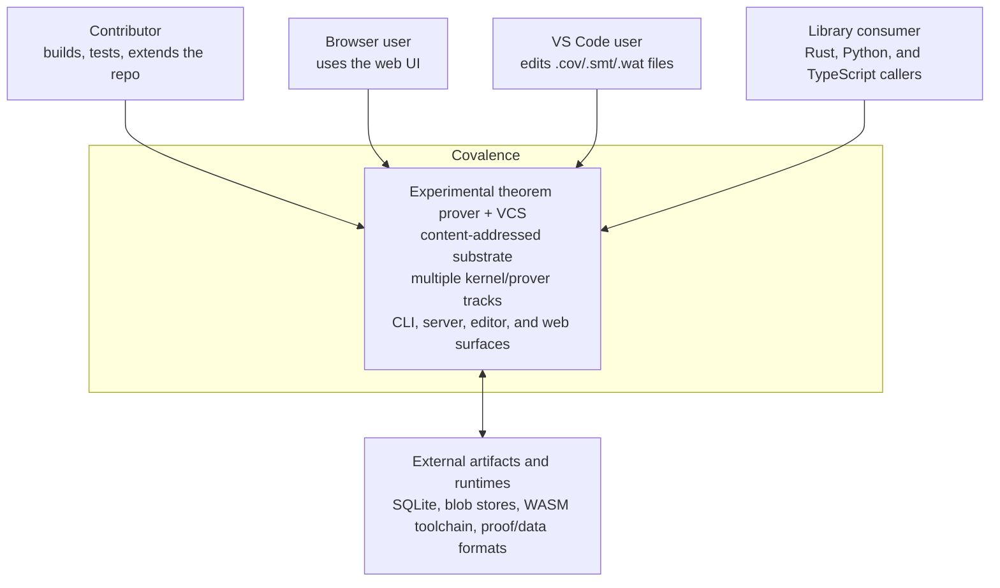
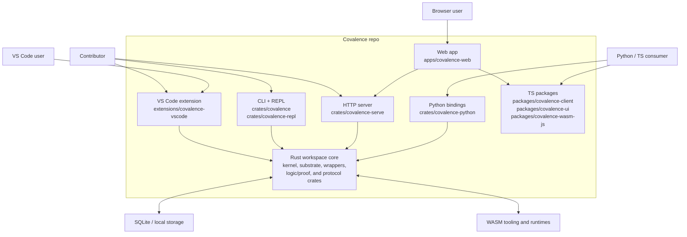
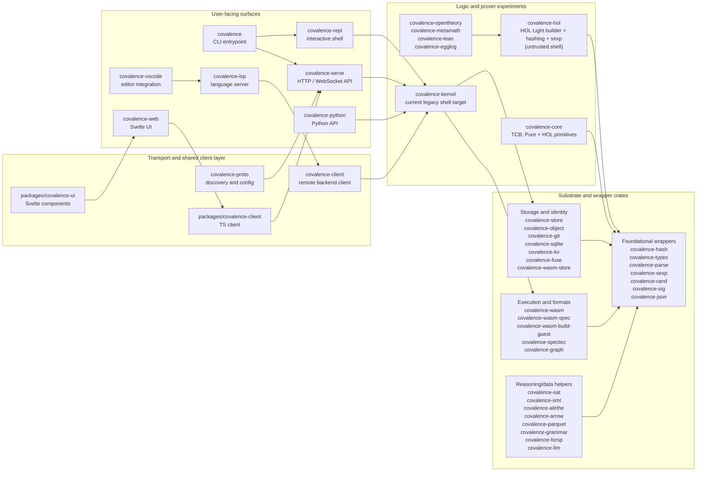

# C4 Architecture Map

This document consolidates the repo into one architecture view.

It is a map of the **current codebase and runtime surfaces**. It does **not**
ratify every proposal in [`design/`](./design/) and it does **not** replace the
canonical philosophy in [`../ARCHITECTURE.md`](../ARCHITECTURE.md).

Use it alongside:

- [`where-we-are.md`](./where-we-are.md) for implementation status
- [`VISION.md`](./VISION.md) for the short conceptual overview
- [`../ARCHITECTURE.md`](../ARCHITECTURE.md) for the target architecture

## Level 1: System Context

### Interpretation

- Covalence is not a single deployable binary. It is a repo with several user
  surfaces over a shared Rust workspace.
- The same codebase serves different modes: direct CLI use, HTTP/web use, editor
  use, and library embedding.
- External runtimes and formats are first-class at the edges, which matches the
  repo's emphasis on wrappers, oracles, and re-checkable integration.

## Level 2: Container View

### Notes

- `covalence-serve` is the main network-facing container; the web app sits on top
  of it rather than replacing it.
- The VS Code extension is a separate user surface with its own transport/runtime
  choices, not just a skin over the web app.
- The repo also exposes library surfaces directly through Python and TypeScript
  packages.

## Level 3: Codebase Component View

### Why this grouping

- The repo is too large for a crate-per-box diagram to stay readable.
- The meaningful split is between:
  user-facing surfaces, transport/protocol adapters, prover/kernel lines, and
  substrate/wrapper crates.
- The current implementation still has **multiple prover lines in parallel**,
  which is why the logic cluster is shown as a family instead of a single core.

## Directory Map

| Area | What it mainly contains |
|---|---|
| `crates/` | Rust workspace: user surfaces, substrate crates, kernels, experiments, wrappers |
| `apps/covalence-web/` | SvelteKit SPA for browser use |
| `packages/` | Shared TypeScript packages used by the web app and browser/WASM integrations |
| `extensions/covalence-vscode/` | VS Code extension for native and browser-hosted editor scenarios |
| `docs/` | Current-state docs, proposal docs, and planning/history |
| `assets/` | Test assets and imported/spec-related source material |
| `tests/`, `test-workbench/` | Integration and experimentation scaffolding |

## Reading the repo after this page

If you want the implementation snapshot after this map, continue with
[`where-we-are.md`](./where-we-are.md).

If you want the intended end-state after this map, continue with
[`VISION.md`](./VISION.md) and [`../ARCHITECTURE.md`](../ARCHITECTURE.md).
