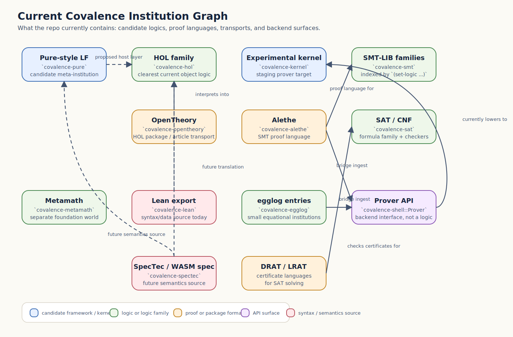
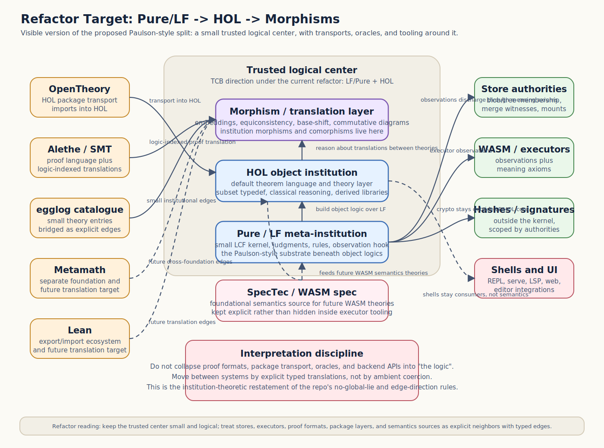

# Institution-Theoretic Map

This document describes the current Covalence repo as a **zoo of
institutions, proof languages, and translations**.

It exists for the current refactor direction: the crate graph is moving, the
preferred kernel shape is moving, and we need a description that survives those
local rearrangements. Institution theory is a better fit for that than a
crate-by-crate narrative because it distinguishes:

- a **logic**,
- a **theory in that logic**,
- a **proof artifact format**,
- and a **translation** between any of the above.

Use this alongside:

- [`where-we-are.md`](./where-we-are.md) for implementation status
- [`c4.md`](./c4.md) for repo/runtime structure
- [`../ARCHITECTURE.md`](../ARCHITECTURE.md) for the target philosophy
- [`../AGENTS.md`](../AGENTS.md) for non-negotiable invariants

## 1. Minimal institution-theory vocabulary

An **institution** gives a logic abstractly as:

- `Sig`: signatures
- `Sen(Σ)`: sentences over a signature `Σ`
- `Mod(Σ)`: models of `Σ`
- `⊨`: satisfaction, invariant under change of notation

The important part here is not category-theory ornamentation. It is the
discipline of keeping these roles separate.

For this repo, the most useful corollaries are:

- A **proof format** is not automatically a logic.
- A **backend API** is not automatically a logic.
- A **theory package** is not automatically a logic.
- A **translation** should be treated as a first-class artifact with a
  direction and preservation claim.

Institutionally, Covalence is trying to become a graph of institutions plus
explicit institution morphisms / comorphisms. Today it already has many of the
pieces, but they are spread across crates and docs and often discussed as if
they were the same kind of thing.

## 2. The load-bearing assumptions, recast institutionally

These are the current invariants that matter even if the implementation is
about to change radically.

| Existing invariant | Institutional reading | Why it is load-bearing |
|---|---|---|
| `SYNTACTIC-WF` | Signature and sentence formation must be defined **syntactically**, not by asking whether something is provable. | Otherwise `Sen(Σ)` depends on theoremhood, which collapses the institution boundary and makes translations unstable. |
| `NO-GLOBAL-LIE` | Truth is always scoped to a signature/theory/authority, never asserted as an ambient universal. | Institutions are indexed by signatures and theories; collapsing that scoping destroys conservative extension and honest transport. |
| `SAFE-AXIOM` | Adding oracle facts must look like conservative extension inside a designated fragment. | This is the current approximation to “extend the theory, don’t rewrite the logic.” |
| `EDGE-DIR` | Translations are directional and typed. | Institution morphisms/comorphisms preserve truth in a stated direction; treating them as undirected coercions is unsound. |
| `CANON-FREEZE` | Equivalent theory presentations need a stable identity convention. | If the same theory gets different identities by derivation path, the translation graph stops commuting operationally. |
| `THREE-CORNERS` | Computation, logic, and evidence are distinct categories of object. | This is exactly the separation between institutions, proof artifacts, and model/observation claims. |
| `UNION-ONLY` / mount discipline | Namespace composition is explicit structure, not semantic equality. | Renaming/import/mount are signature-level or theory-level operations, not theoremhood. |

The practical point: the refactor can replace `covalence-kernel`, merge crates,
or move from HOL-shaped to Pure-shaped internals, but these constraints still
need to survive as the conditions for any sane institution graph.

## 3. The current zoo, classified

The repo currently contains four different species of thing.

### 3.1 Institutions or candidate institutions

These are actual logics, or explicit attempts to host logics.

| System | Current repo locus | Institutional role |
|---|---|---|
| Pure-style LF | [`crates/covalence-pure`](../crates/covalence-pure/src/lib.rs) | Candidate **meta-institution** / logical framework. Provides judgments and rules intended to host upper-layer object logics. |
| HOL Light-style HOL | [`crates/covalence-hol`](../crates/covalence-hol/src/lib.rs) | Object logic institution with a concrete proof kernel. |
| Experimental arena HOL kernel | [`crates/covalence-kernel`](../crates/covalence-kernel/src/lib.rs) | Another object-logic implementation, but explicitly a staging kernel rather than a settled semantic target. |
| SMT-LIB logic families | [`crates/covalence-smt`](../crates/covalence-smt/src/lib.rs) | Better viewed as a **family of institutions indexed by `(set-logic ...)`** such as `QF_UF`, `QF_LIA`, etc. |
| Propositional CNF/SAT | [`crates/covalence-sat`](../crates/covalence-sat/src/lib.rs) | Small institution family for propositional satisfiability problems and certificates. |
| Metamath foundations | [`crates/covalence-metamath`](../crates/covalence-metamath/src/lib.rs) | Parser/verifier for a distinct proof/foundation world; institutionally separate from HOL/Pure. |
| egglog catalogue entries | [`crates/covalence-egglog`](../crates/covalence-egglog/src/lib.rs) and [`docs/design/proposals/egglog-integration/README.md`](./design/proposals/egglog-integration/README.md) | Best seen as a **family of small equational / relational institutions**, one per catalogue entry. |

### 3.2 Theory/package layers

These are not new logics by themselves. They package theories or theory
dependencies inside an existing logic.

| System | Current repo locus | Institutional role |
|---|---|---|
| OpenTheory packages/articles | [`crates/covalence-opentheory`](../crates/covalence-opentheory/src/lib.rs) | Theory/package layer for HOL-family theories; not a new logic, but a transport format and dependency discipline for HOL theories. |
| Corelib / stdlib proposals | [`docs/design/proposals/shared-backbone/notes/core-lib.md`](./design/proposals/shared-backbone/notes/core-lib.md) | Intended theory libraries internal to the future framework, not separate institutions. |

### 3.3 Proof and certificate languages

These describe derivations inside some underlying logic family.

| System | Current repo locus | Institutional role |
|---|---|---|
| Alethe | [`crates/covalence-alethe`](../crates/covalence-alethe/src/lib.rs) | Proof language for SMT-family derivations; parameterized by the active SMT logic. |
| DRAT / LRAT | [`crates/covalence-sat`](../crates/covalence-sat/src/lib.rs) | Certificate languages for SAT solving; not standalone logics. |
| egglog proof DAGs | [`crates/covalence-egglog`](../crates/covalence-egglog/src/proof.rs) | Derivation artifact format for a given egglog theory entry. |
| OpenTheory articles | [`crates/covalence-opentheory`](../crates/covalence-opentheory/src/lib.rs) | Proof/program artifacts for HOL-family content, interpreted against a HOL backend. |

### 3.4 Adapters, APIs, and semantics sources

These mediate between institutions or provide syntax/semantics inputs.

| System | Current repo locus | Institutional role |
|---|---|---|
| `covalence-shell::Prover` | [`crates/covalence-shell/src/prover.rs`](../crates/covalence-shell/src/prover.rs) | Stable **implementation interface** for theorem-prover backends. Not itself a logic. |
| `HolLightKernel` traits | [`crates/covalence-hol/src/traits.rs`](../crates/covalence-hol/src/traits.rs) | Backend interface for OpenTheory import into HOL-style kernels. Not itself a logic. |
| Lean export reader | [`crates/covalence-lean`](../crates/covalence-lean/src/lib.rs) | Syntax/export ingestion from a different theorem-prover ecosystem; currently a data source, not a checked translation. |
| SpecTec + WASM spec ingestion | [`crates/covalence-spectec`](../crates/covalence-spectec/src/lib.rs) and [`crates/covalence-wasm-spec`](../crates/covalence-wasm-spec/fuzz/README.md) | Semantics-source layer for future object theories and oracle meaning claims. |

## 4. Current systems as an institution graph

The cleanest way to read the repo today is as an incomplete graph:

Rendered SVG is embedded here intentionally because Mermaid support is not
uniform across Markdown viewers.

Two important caveats:

- The diagram is **about role**, not about current dependency edges only.
- Several arrows are still only partially implemented, proposed, or unstable.

## 4.1 Refactor target graph

The proposed direction is more specific than the current graph: shrink the
trusted center to a **Pure/LF substrate plus HOL object logic**, then treat
everything else as translation, transport, oracle, or tooling around that
center.

This is the institution-theoretic version of the current "Larry Paulson
homage" line running through
[`where-we-are.md`](./where-we-are.md),
[`design/proposals/stacked-pure-hol/README.md`](./design/proposals/stacked-pure-hol/README.md),
and [`design/proposals/layered-framework/README.md`](./design/proposals/layered-framework/README.md).
The target view now also separates **Metamath** and **Lean** as distinct
translation neighbors, and shows **SpecTec / the WASM spec** as an explicit
foundational semantics source rather than generic tooling.

## 5. Where the current repo is institutionally clean

Despite the churn, the repo already has some strong separations.

### 5.1 It separates backend API from object logic

[`covalence-shell::Prover`](../crates/covalence-shell/src/prover.rs) is the
best current example. It does not claim to *be* the logic. It is the common
implementation surface that Alethe, egglog, and future frontends target while
the underlying prover changes.

Institutionally: this is a good sign. It means proof-language adapters are not
hard-coded to one kernel presentation.

### 5.2 It already treats OpenTheory as transport into HOL, not as “the logic”

[`covalence-opentheory`](../crates/covalence-opentheory/src/lib.rs) explicitly
programs against a HOL-kernel trait. That is the right kind of separation:
OpenTheory is a package/article discipline over a HOL-family logic, not an
independent foundation in this repo.

### 5.3 It already treats SMT and SAT as families

[`covalence-smt`](../crates/covalence-smt/src/problem.rs) records the chosen
SMT logic per problem. [`covalence-sat`](../crates/covalence-sat/src/lib.rs)
keeps the certificate layer distinct from the formula layer. Those are both
institution-theoretically healthier than pretending there is one monolithic
"SMT logic" or one monolithic "solver truth source."

## 6. Where the current repo is institutionally muddy

These are the places where the refactor should raise the bar.

### 6.1 `covalence-kernel` is both logic candidate and transition substrate

[`covalence-kernel`](../crates/covalence-kernel/src/lib.rs) is currently asked
to play two roles:

- an object-logic implementation,
- and a compatibility target for frontends while the redesign is in flight.

That is institutionally unstable. The staging role pressures the API toward
pragmatic escape hatches, while the logic role wants semantic austerity.

### 6.2 Proof formats and theory translations are not yet a uniform concept

Alethe, OpenTheory, egglog, Metamath, and Lean exports are all “ways content
arrives,” but they are not all the same kind of translation:

- some are proof scripts for an already-chosen logic,
- some are theory/package transports,
- some are exports from another prover,
- some are certificate formats for an external procedure.

The repo currently has custom bridge code for each family, but not yet one
uniform institution-theoretic abstraction over those bridges.

### 6.3 The model side is mostly implicit

Most current crates implement:

- syntax,
- derivation,
- translation,
- and sometimes certificate checking.

They do **not** generally expose `Mod(Σ)` and `⊨` directly. That is fine, but
it means the institution view here is partly architectural and semantic, not
fully reified in code yet.

## 7. Refactor guidance from this view

If the current direction is “radical changes, rapidly switching among logical
theories,” then institution theory suggests a clearer decomposition than
crate-by-crate preservation.

### Preserve these roles

- One or more **meta-institutions / frameworks** that host object logics.
- A set of **object institutions**: HOL, SMT fragments, equational theories,
  future WASM semantics theories, etc.
- A set of **proof languages / certificate languages** parameterized by an
  underlying object institution.
- A set of **institution morphisms/comorphisms** that explicitly state what is
  being preserved and in which direction.

### Do not conflate these roles

- Do not treat a proof format as if it were the logic.
- Do not treat a stable backend trait as if it were the semantics.
- Do not treat theory packaging as if it were theoremhood.
- Do not treat content identity or serialization as if it settled logical
  equivalence.

### Make translation objects first-class

The recurring theme across the repo is already “explicit edges”:

- OpenTheory import into HOL
- Alethe ingest into a prover backend
- egglog proof-store ingest into a prover backend
- future embeddings/equiconsistency/base-shift edges in the architecture docs

Institution theory says those edges are not glue code. They are the core
objects that make a multi-logic system intelligible.

## 8. Working interpretation of the current zoo

If you need one short sentence:

> Covalence is not currently “one prover with some importers”; it is an
> incomplete **institution graph** with several candidate base logics, several
> proof languages, several theory/package transports, and one emerging policy
> that all cross-system movement should happen through explicit, typed
> translations rather than ambient coercion.

That is the description to preserve during the refactor, even if most of the
crate boundaries change.
