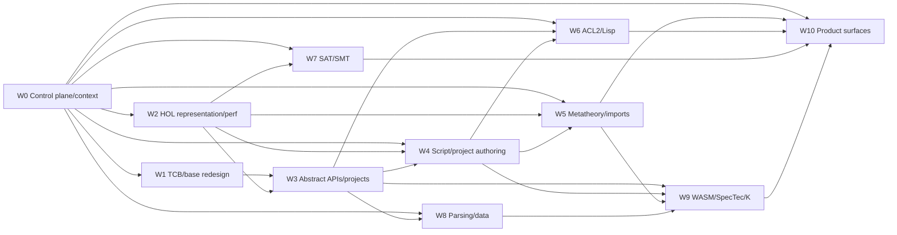
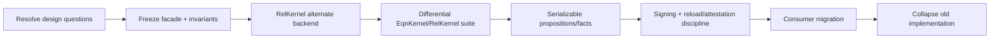
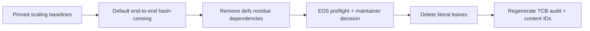
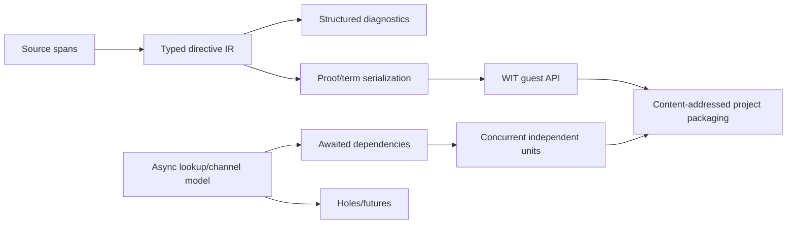
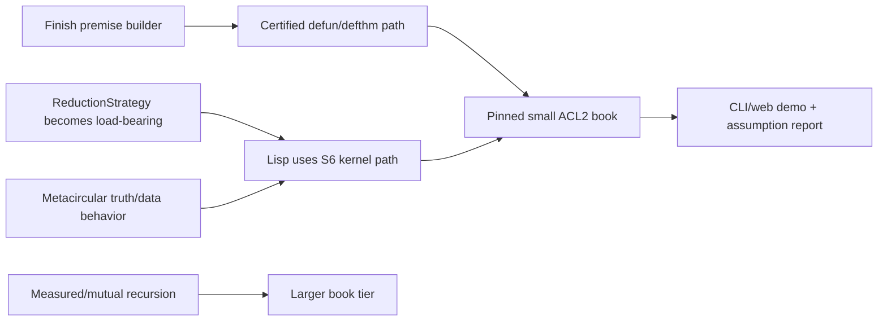
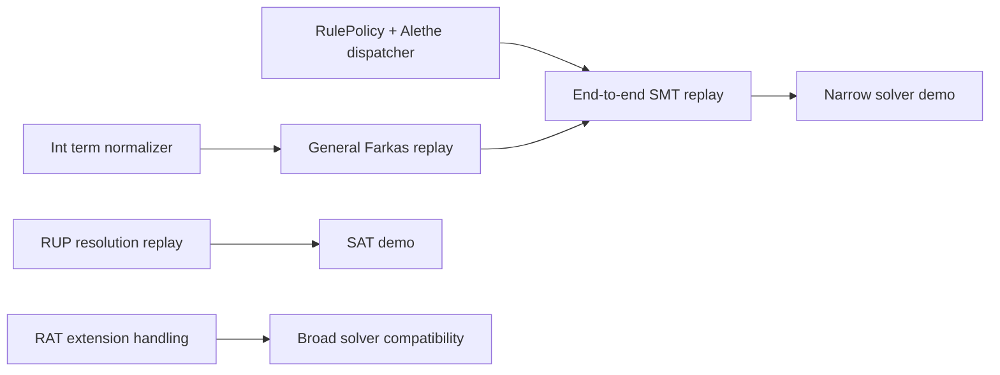

# Workstreams and present-state report

**Status:** AI-drafted portfolio plan, 2026-07-18. Counts and trust metrics are
point-in-time facts generated from `docs/todos/todos.json` and `docs/deps/`;
sequencing and priorities are proposals. This refines
[`consolidation-and-context-roadmap.md`](./consolidation-and-context-roadmap.md).

## Executive assessment

Covalence is past the “collection of sketches” stage but not yet at the
“coherent prover product” stage. The repository already contains:

- a working closed-world base and HOL kernel tower;
- a fast full-`set.mm` parser/verifier and substantial HOL-side Metamath
  metatheory;
- real ACL2 soundness/definition/induction work integrated with Lisp;
- SAT resolution and linear-arithmetic/Alethe checking foundations;
- substantial SpecTec grammar and WASM-semantics lowering;
- K, Haskell, Lisp, Forsp, OpenTheory, web, REPL, server, LSP, and Python
  surfaces;
- generated dependency/TCB audits, benchmarks, and now a queryable open-work
  database.

The main problem is convergence. `covalence-init` currently owns the theory
catalogue, script system, models, parsing theories, metalogic, ACL2, K, SpecTec,
and WASM lowering. Its 139 work items—34 severe—are evidence that it is both the
project's integration engine and its largest organizational bottleneck.

The recommended program is therefore:

1. stabilize the trust/API waist;
2. split ownership into independent workstreams without immediately churning
   crate paths;
3. polish three end-to-end products in parallel;
4. extract reusable traits and project packaging from demonstrated needs;
5. execute the relational-base swap and WASM/K/SpecTec consilience flagship
   behind those stable surfaces.

## Snapshot

### Repository and trust surface

| Measure | Current value |
|---|---:|
| Workspace crates | 62 |
| Internal normal dependency edges | 178 |
| Workspace crates in generated TCB closure | 5 |
| Base trusted source | 14 files / 1,496 non-test lines |
| Base + HOL trusted source | 57 files / 6,951 non-test lines |
| Base + HOL target after residue removal | 37 files / 5,142 non-test lines |
| Base + HOL + eval source | 91 files / 13,281 non-test lines |
| Theorem mint sites | 24 |
| Core admitted rules | 25 |
| Eval admitted rules | 17 |
| Builtin canonical rules | 387 |

The 24 mint sites are stable across the current tiers. The important audit
problem is therefore not a proliferation of mint calls; it is the size and
shape of the languages/rules admitted around them, especially the 6,330-line
gap between pure HOL and the eval tier.

### Open-work census

| Crate/area | Total | Severe | Reading |
|---|---:|---:|---|
| `covalence-init` | 139 | 34 | Primary convergence and ownership bottleneck |
| `covalence-pure` | 21 | 5 | Base redesign and later language stages |
| `covalence-hol-eval` | 16 | 0 | Definitional coverage and leaf migration |
| `covalence-core` | 14 | 2 | Hash-consing and trusted residue |
| `covalence-k` | 13 | 0 | Broad but bounded frontend gaps |
| `covalence-lisp` | 13 | 2 | REPL seam and complete metacircular behavior |
| `covalence-metamath` | 9 | 0 | Product polish and scalable representations |
| `covalence-haskell` | 8 | 4 | Experimental frontend, not critical path |
| `covalence-alethe` | 8 | 0 | Existing concrete SMT bridge coverage |
| `covalence-kernel-smt` | 6 | 3 | Generic replay critical path |
| `covalence-kernel-sat` | 4 | 1 | RAT/DRAT completeness gap |

These counts measure recorded work, not effort. A severe TCB item can outweigh
dozens of catalogue polish items.

## Biggest holes

### 1. The base redesign is scaffolded, not decided

The `CertificateAlgebra` facade, positive relation primitives, and TCB SQLite
proof of concept exist. What does not yet exist is an accepted design for:

- serialized schematic propositions;
- relation/fact identity;
- signature granularity;
- attestation and reload discipline;
- migration sequencing;
- the exact evaluation/disequality seam.

This is the most important design hole because it governs the future TCB, but it
should not block unrelated demo polish. The safe parallel strategy is to freeze
the current facade, implement an alternate backend behind it, and require
differential results before switching consumers.

### 2. Literal leaves and hash-consing still distort the HOL tower

The trusted HOL core retains transitional definition machinery tied to literal
leaves. Hash-consing exists but is not threaded end to end. Consequences include:

- a larger-than-target pure-HOL TCB;
- duplicated construction/interning APIs;
- avoidable allocation and super-linear behavior;
- continued coupling between representation cleanup and definition machinery.

Leaf elimination is a one-way migration and needs its own maintainer gate.
Default hash-consing is independently valuable and can proceed first.

### 3. The script/project layer is not a reliable project substrate

The `.cov` stack lacks:

- source spans and structured diagnostic traces;
- a fully typed parse/elaboration/execution pipeline;
- true awaited dependencies;
- term-level holes/futures;
- concurrent independent-unit compilation;
- general Rust/`.cov` dependency cycles;
- a stable proof/term serialization format;
- a settled WIT guest API.

This blocks agent-friendly proof authoring and content-addressed prover
projects more directly than most missing mathematical definitions.

### 4. Metatheory has a working core but not the general translation bridge

The generic derivability/database relation exists, and `set.mm` verifies.
Remaining keystones are:

- structural substitution/translation at the live Metamath carrier;
- `ValidProof` versus `Derivable_DB` grounding;
- general arbitrary-database HOL sink/replay;
- scalable import representation/interning;
- concrete theory relationships such as `set.mm` axioms into GT;
- native-HOL versus Metamath-HOL representation equivalence.

Until these land, Metamath is an excellent verifier demo but not yet the full
logical-thin-waist product.

### 5. ACL2 is real but split across two execution paths

The ACL2 ladder has definitions, induction, ordinals, and certified theorem
work. The main holes are:

- the partial premise builder;
- measured/mutual recursion tiers;
- integration of `crates/lang/lisp` with the S6 kernel path;
- the REPL bypassing the general reduction strategy;
- full metacircular truthiness/data behavior;
- book-reader and primitive coverage beyond the demonstrated fragment.

This is a strong near-term product because it exposes both architectural seams
and a compelling theorem-proving workflow.

### 6. SAT/SMT foundations do not yet form a generic end-to-end replay

Resolution and Farkas machinery exist, but:

- SAT replay does not handle RAT steps;
- generic SMT replay lacks an `Int` term normalizer;
- general scale-and-sum Farkas replay is missing;
- the generic Alethe dispatcher is missing;
- the existing concrete `covalence-alethe` bridge covers only selected rules and
  goal shapes.

The first product should remain deliberately narrow: one solver-generated
certificate, replayed to a kernel theorem with the solver outside the TCB.

### 7. WASM/SpecTec/K has breadth but no small proved commuting diagram

The repository can parse and lower substantial SpecTec/WASM and K fragments.
The severe gaps cluster around exactness:

- sortless metavariables and coarse encoding;
- mutually recursive variants and constructor freeness;
- erased premises and rule conditions;
- real definitions/predicates for SpecTec `Dec`/relations;
- stack/performance behavior at whole-spec scale;
- K substitution, binders, cells, KSequence, and guarded builtins;
- no shared-fragment equivalence theorem between SpecTec and K paths.

The next milestone should be a tiny exact shared fragment, not broader syntax
coverage.

### 8. Foundational APIs are promising but not yet the default consumer path

`covalence-hol-api`, `covalence-inductive`, and numeral backend traits show the
right direction. They are not yet broad or adopted enough to support the full
datatype/parsing/numerics vision:

- existing consumers still name concrete HOL types;
- datatype traits do not yet cover lists, fixpoints, linear algebra, parsing,
  or general induction;
- alternate representations exist as experiments but equivalence theorems are
  not consistently packaged as API deliverables;
- WIT/content-addressed out-of-tree projects are not yet a supported boundary.

## Program structure

Use ten workstreams. A workstream owns a coherent acceptance surface; it is not
necessarily one crate.

| ID | Workstream | Primary areas | Product/gate |
|---|---|---|---|
| W0 | Control plane and context | TODO DB, deps, projects, skills, CI | Agents can select and verify bounded work |
| W1 | TCB/base redesign | `kernel/base`, `tcb-db` | Accepted relational-base design + differential backend |
| W2 | HOL representation/performance | `hol/core`, `hol/eval` | Default hash-consing; leaf-removal gate; smaller target TCB |
| W3 | Abstract APIs and projects | `hol/api`, `inductive`, numerals, WIT | Two representations + proved equivalence, out-of-tree project |
| W4 | Script/project authoring | `init/script`, `project`, LSP | Spanned typed pipeline and reproducible multi-unit project |
| W5 | Metatheory/imports | Metamath, metalogic, OpenTheory | `set.mm` product + explicit axiom/translation report |
| W6 | ACL2/Lisp | Lisp, `init/acl2`, repl-core | Small book with definition, induction, theorem, web/CLI |
| W7 | SAT/SMT automation | SAT, SMT, Alethe | External solver certificate replayed to a kernel theorem |
| W8 | Parsing/data foundations | grammar, regex/CFG, text, S-expr/JSON | Two parser paths proved same-AST under a PER |
| W9 | WASM/SpecTec/K | wasm, spectec, K, metalogic | Exact shared fragment + relationship theorem |
| W10 | Product surfaces | CLI/server/web/VS Code/Python | Common demo shell, assumption/TCB display, benchmarks |

## High-level DAG

This is a dependency graph, not a serial schedule. W1's design can run while W2
implements reversible hash-consing; W5, W6, and W7 can polish current demos
against the existing kernel; W8 can build backend-neutral parsing interfaces;
W10 can establish the shared demo shell before every proof is complete.

## Workstream plans

### W0 — control plane and context

**Now:** source-local markers, deterministic JSON, cached SQLite, dependency/TCB
generation, and query filters exist.

**Next:**

1. add explicit `project`, `blocked_by`, and `acceptance` metadata;
2. add checked-in project manifests;
3. validate dependency IDs and expose `--ready`;
4. overlay projects on the crate dependency graph;
5. generate crate/project context packs;
6. add benchmark sample storage and comparison.

**Exit:** an agent can ask for one ready task, receive bounded context, run its
acceptance command, and report metric/TCB movement.

### W1 — TCB/base redesign

Only the last two stages are destructive. All earlier stages should be additive.

### W2 — HOL representation and performance

Hash-consing and property-test coverage can run in parallel. Literal deletion
waits for all representation consumers and one-way-door review.

### W3 — abstract APIs and prover projects

Start with one narrow spine:

1. natural numbers: unary and double/succ;
2. bytes/string views over lists;
3. records/variants as a polynomial-functor example;
4. constructors, eliminators, laws, and content identity as separate traits;
5. equivalence/isomorphism theorem packaged with each alternate backend;
6. compile one consumer as a WASM component using the WIT boundary.

Do not start matrices, graphs, SQL, or every text format before this spine is
usable out of tree.

### W4 — script/project authoring

Spans/typed IR and async dependency work are independent early lanes.

### W5 — metatheory and imports

Parallel lanes:

- **Product lane:** keep full `set.mm` verification fast and reproducible; show
  axiom use and content identity.
- **Representation lane:** symbol interning, streaming/lazy loading, structured
  expressions.
- **Kernel lane:** arbitrary-database sink, `ValidProof ↔ Derivable_DB`,
  structural translation, scoped-to-full derivability.
- **Theory lane:** `set.mm`/GT relationship, HOL.mm/native HOL equivalence,
  OpenTheory interpretation support.

The product lane can ship before the last theory relationship is complete, but
must label the missing theorem honestly.

### W6 — ACL2/Lisp

The small-book demo does not wait for the larger recursion tier.

### W7 — SAT/SMT automation

The narrow SMT demo and RUP-only SAT demo can ship before RAT completeness.

### W8 — parsing and data foundations

1. settle bytes/string traits from W3;
2. define parsing as relation, partial function, and total/refined function;
3. define same-AST PER;
4. connect regex recognition to parser results;
5. connect CFG derivations to parser results;
6. deliver S-expression first;
7. deliver JSON second;
8. add binary/tabular formats only after the common data-model morphism API is
   exercised.

Regex warm-up and whole-module CFG performance remain benchmark projects, not
reasons to weaken proof obligations.

### W9 — WASM/SpecTec/K consilience

Select a tiny fragment with:

- exact syntax types;
- one or two constructors;
- one state/configuration form;
- one unconditional and one conditional step;
- both SpecTec and K encodings;
- an explicit translation;
- a proved step-preservation/relationship theorem.

Then widen in this order: constructor freeness → recursive variants → premise
coverage → builtin hooks → traces → whole-module/spec scale.

### W10 — product surfaces

Build one reusable demo component showing:

- claim/input;
- proof or derivation status;
- assumptions and admitted language tier;
- content IDs;
- dependency/project graph;
- benchmark sample;
- exact reproduction command.

Metamath, ACL2, and SMT/SAT are the first three instances. WASM/K/SpecTec is the
fourth.

## Parallel execution waves

### Wave A — decisions and reversible foundations

Run concurrently:

- W0 project metadata and ready-task queries;
- W1 relational-base design resolution;
- W2 hash-consing baselines/implementation;
- W4 spans and typed IR;
- W5 Metamath product report;
- W6 premise-builder/reduction seam;
- W7 narrow replay plumbing;
- W10 common demo shell.

### Wave B — three honest products

Run concurrently after their local gates:

- Metamath full-database demo;
- ACL2 small-book demo;
- SAT/SMT certificate demo;
- foundational nat/bytes trait spine;
- parsing/S-expression consilience slice.

### Wave C — packaging and backend independence

- content-addressed project manifests;
- WIT guest API and one out-of-tree project;
- alternate relational certificate backend;
- generic database/translation interfaces;
- project overlays in CLI/web.

### Wave D — one-way migrations and semantic flagship

- leaf deletion after maintainer gate;
- base backend switch after differential gate;
- SpecTec/K shared-fragment theorem;
- signed fact persistence after trust-policy acceptance.

## Coordination rules

- One workstream owns each TODO ID; cross-stream dependencies are explicit, not
  duplicated markers.
- A change touching trusted code reports TCB audit deltas.
- A performance change reports pinned correctness results and distributions, not
  one timing.
- An API is not “done” without a second implementation or a stated reason it is
  representation-unique.
- A demo is not “done” without a reproduction command and assumption report.
- One-way changes—content identity changes, leaf deletion, rule-manifest changes,
  signing/attestation policy—require maintainer review.
- Keep at most one integration branch/project per workstream; merge reversible
  foundations frequently to prevent long-lived architectural forks.

## Suggested initial ownership split

With several humans/agents available, allocate:

1. **Kernel lane:** W1 + maintainer-gated parts of W2.
2. **Developer-platform lane:** W0 + W4.
3. **Metatheory/product lane:** W5 + Metamath instance of W10.
4. **Language lane:** W6 + ACL2 instance of W10.
5. **Automation lane:** W7 + automation instance of W10.
6. **Semantics lane:** W8 + preparatory W9.
7. **API/package lane:** W3, consuming results from the other lanes.

The lanes share contracts and artifacts, not ownership of the same files. Work
inside `covalence-init` should first be assigned by module/workstream; physical
crate extraction follows only after APIs stabilize.
